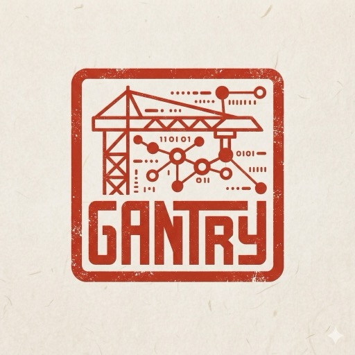

<p align="center">
  
</p>

<p align="center">
  <strong>Open-source reliability and execution layer for data movement and analysis.</strong>
</p>

Gantry sits above the transport and processing infrastructure you already run. It does not
own the bytes on the wire — it owns the execution contract around them: checkpoints, replay,
ordering boundaries, idempotency, verification, policy, provenance and recovery.

> Agents may plan and re-plan. Deterministic infrastructure enforces guarantees.

## The problem

An engine reporting `SUCCESS` tells you a query ran. It does not tell you whether the join
multiplied its input, whether the rows you read were complete, or whether the number you are
about to act on came from the data you think it did.

That gap is usually filled by convention — a runbook, a reviewer, an analyst who remembers.
Gantry fills it with code that runs every time:

```text
well-formed  ENGINE: SUCCESS  GANTRY: PASSED  rowExpansion 1.0000x   → 4 findings
expanding    ENGINE: SUCCESS  GANTRY: FAILED  rowExpansion 2.0000x   → findings withheld
                              the join expanded 40,000 rows to 80,000 (2.00x)
```

Same SQL, same engine, same data. One of them means something.

## When do you need Gantry?

Gantry is for the moment when "the job succeeded" stops being enough.

**You need it when any of these are true.**

*You are moving data and cannot afford to guess.* You are replicating a table
into a warehouse, migrating between databases, or keeping a copy in sync. The
copy job reports success. Nobody can tell you whether the target actually
matches the source, and the only way to find out is a full comparison that
takes hours.

*A worker dies and you do not know what to do.* Something crashed halfway
through a hundred-million-row copy. Restarting from the beginning wastes a day.
Restarting from "wherever it got to" risks duplicating or skipping rows,
because nothing recorded where it got to in a way you can trust.

*Something is wrong with one chunk and you have to redo everything.* A checksum
is off. The table is fine except for one range of keys, but the tooling only
knows how to copy the whole thing again.

*An analysis returned a number and you cannot check it.* A query ran and
produced a figure someone is about to act on. You cannot easily tell whether a
join silently multiplied the rows, whether it matched almost nothing, or which
version of the data it read.

*You want an agent or an LLM near your data, carefully.* You would like a model
to investigate an incident or write an analysis, but not to be able to read raw
customer rows, run something unbounded, or mark its own conclusion as verified.
Asking it nicely in a prompt is not a control.

*"Where did this number come from?" takes a day to answer.* A dashboard figure
is disputed. Tracing it back through pipeline runs, table versions and query
history is manual archaeology.

**You probably do not need it when:**

- You already have a warehouse-native tool that covers your case end to end
- Your data is small enough that a full re-copy and a full re-check are cheap
- You are looking for a scheduler or an orchestrator — Gantry is not one, and
  it runs *on* Temporal rather than replacing it
- You want a query engine — Gantry compiles onto PostgreSQL and DuckDB rather
  than competing with them

**What Gantry is not.** It does not store your data, replace your database or
warehouse, replace your orchestrator, or make an LLM trustworthy. It makes what
an LLM (or a person, or a cron job) does with your data *checkable*.

## The model

Four resources. One noun, two verbs, and the thing you are allowed to believe at the end.

```text
                                ┌─────────────────┐
                      ┌────────►│     DATASET     │◄────────┐
                      │         │                 │         │
                      │         │  schema, keys,  │         │
                   produces     │  time, stats,   │       reads
                      │         │  policy —       │         │
                      │         │  versioned by   │         │
                      │         │  content hash   │         │
                      │         └─────────────────┘         │
                      │                                     │
              ┌───────┴───────┐                     ┌───────┴───────┐
              │   MOVEMENT    │                     │   ANALYSIS    │
              │               │                     │               │
              │  snapshot,    │                     │  normalise,   │
              │  change       │                     │  join,        │
              │  stream,      │                     │  aggregate,   │
              │  repair       │                     │  derive       │
              └───────┬───────┘                     └───────┬───────┘
                      │                                     │
                      └──────────────────┬──────────────────┘
                                         ▼
                                ┌─────────────────┐
                                │     RESULT      │
                                │                 │
                                │  what is true,  │
                                │  the evidence,  │
                                │  and where the  │
                                │  data came from │
                                └─────────────────┘
```

### Dataset — the thing everything else is about

A Dataset is **a named unit of data plus everything Gantry knows about it**: its columns and
types, which column is the key, which column carries time, how many rows it has, how skewed
they are, which fields are sensitive, and what an agent may do with it.

Most of that is discovered for you. `gantry discover` reads the catalog and profiles the
table; you only declare what a catalog cannot know — that `created_at` is the column that
*orders* the data, that `email` is sensitive.

The important part is that a Dataset is **versioned by content**. Register the same
description twice and nothing happens. Change something real — a new column, a fresh profile —
and you get version 2, with version 1 still intact.

That matters because everything downstream pins a *version*:

> An Analysis that ran last Tuesday says it read `public.orders@4`. Not "orders", not
> "orders as it was, probably". Version 4, identified by a hash of its description. If
> someone asks in March what that number was computed over, the answer is exact.

### Movement — make or keep a Dataset available somewhere

A Movement copies a Dataset from one place to another and **keeps proving it arrived**.
Replicating a production table into a warehouse. Migrating between databases. Keeping a
mirror in sync as rows change.

You describe the destination, the key, and how to split the work. You do **not** write
partition boundaries — those come from the data itself at plan time, so they reflect how it
is actually distributed rather than a guess made months ago.

What you *do* write is what must be true when it finishes:

```yaml
verification:
  required: [row_count, chunk_checksum]
```

Gantry then owns the awkward parts: splitting a hundred million rows into partitions of even
size, checkpointing each one as it commits, resuming exactly where it stopped when a worker
dies, rejecting a change event that arrives out of order, and — when a checksum disagrees —
finding *which rows* differ and re-copying only the partition holding them.

### Analysis — compute over one or more Datasets

An Analysis is **a question asked of your data, written down in a way that can be checked**.
"Did the deploy at noon make checkout slower?" is an Analysis: it reads request logs and
deploy events, lines them up in time, and compares before against after.

You describe *what to compute*, not how:

- **`normalize`** — reconcile names. One source calls it `svc`, the other `service_name`.
- **`joins`** with **`temporal`** — line up two streams of events in time. `nearest_preceding`
  attributes each request to the deploy that was actually live when it happened, rather than
  to every deploy in range.
- **`signals`** — named measures like `p95_latency` or `error_rate`, from a fixed vocabulary
  rather than SQL you write. A spec that accepted arbitrary SQL would make Gantry a query
  language, and your engine already is one.
- **`verify`** — what must hold for the answer to mean anything.

That last block is the one that earns its keep. `rowExpansion: {max: 1.1}` says: if this join
multiplies my rows, the aggregates over it are counting some rows twice, so do not hand me
the answer.

### Result — what you are allowed to believe

A Result is not a number in a Slack message. It carries:

- **the findings** — each with the measurements behind it, and a label saying whether the
  confidence is *measured*, *statistical*, or *a model's opinion*. A number that sometimes
  means one and sometimes the other is worse than no number.
- **the verification record** — every check that ran, what it measured, what was allowed.
- **the provenance** — the exact SQL that ran (by content hash), the exact Dataset versions
  read, and the Movement checkpoints those Datasets had reached.

If verification fails, the findings are **withheld**, not published with a warning attached —
a caveat gets dropped the moment someone quotes the number. The Result is still written,
because *why* nothing could be concluded is itself worth keeping.

## One lifecycle, two Operations

Movement and Analysis differ in what they *do* at each stage, not in the stages they pass
through. That is why they share one state machine, one plan format, one checkpoint store and
one verification framework — rather than three of each, drifting apart.

```text
  Plan ──► Generate ──► Validate ──► Execute ──► Verify ──► Result
    │          │            │            │          │          │
    │          │            │            │          │          └── what may now be asserted
    │          │            │            │          └───────────── may it be believed?
    │          │            │            └──────────────────────── the engine does the work
    │          │            └───────────────────────────────────── may this run at all?
    │          └────────────────────────────────────────────────── compile to something runnable
    └───────────────────────────────────────────────────────────── decide what to do, pin what to read
```

| Stage | Movement | Analysis |
|---|---|---|
| **Plan** | discover, profile, partition, order by dependency | resolve inputs, pin Dataset versions |
| **Generate** | partition bounds, copy statements, connector config | compile the spec to engine SQL |
| **Validate** | check the target's shape, key and write mode | plan the query, estimate cost, sample it |
| **Execute** | copy partitions, apply changes, checkpoint | run the artifact on an engine |
| **Verify** | row counts, checksums, key uniqueness, referential integrity | row expansion, join coverage, temporal alignment, null rate |
| **Result** | `MovementResult` | `AnalysisResult` with findings |

### The guarantee boundary

The whole point of the diagram above is the gap between its last two stages.

```text
                                      ┌───────────────┐   ┌───────────────┐
   Plan ─► Generate ─► Validate ─────►│    EXECUTE    │──►│    VERIFY     │──► Result
                                      └───────┬───────┘   └───────┬───────┘
                                              │                   │
                                       "the query ran"   "the answer holds"
                                         the engine            Gantry
                                        answers this        answers this
```

These are two different questions and they get two different answers. `SUCCESS` from an
engine means the query it was handed ran to completion — nothing more. A join that multiplied
forty thousand rows into eighty thousand succeeds; so does one that matched almost nothing.
Verify is where Gantry asks whether the numbers mean what the spec said they would, and it is
the only stage that can say no on grounds the engine has no opinion about.

Every guarantee in this project lives in that gap.

## How do you use it?

Three things you write, and one thing you read. The concepts are above; this is the
shape of the files and the commands that act on them.

### 1. Describe your data — a Dataset

```yaml
apiVersion: gantry.dev/v1alpha1
kind: Dataset
metadata:
  name: public.orders
physical:
  adapter: postgres
  reference: public.orders
schema:
  keys: [order_id]
semantics:
  timeField: created_at        # discovery cannot know which column orders time
access:
  agentPolicy: aggregate_or_masked
```

`gantry discover` fills in the columns, types and statistics. What you write by hand is
only what a catalog cannot know.

### 2. Move it — a Movement

```yaml
apiVersion: gantry.dev/v1alpha1
kind: Movement
metadata:
  name: orders-snapshot
source:
  adapter: postgres
  connectionRef: source
destination:
  adapter: postgres
  connectionRef: target
strategy:
  mode: snapshot                 # or snapshot_then_stream, to keep it in sync
datasets:
  - name: public.orders
    source: public.orders
    target: public.orders
    key:
      columns: [order_id]
    partitioning:
      strategy: range
      column: order_id
      rowsPerPartition: 2000000
    verification:
      required: [row_count, chunk_checksum]     # what must be true afterwards
```

```bash
gantry plan   movement.yaml    # compile an immutable, content-addressed plan
gantry start  movement.yaml    # run it, checkpointing every partition
gantry verify movement.yaml    # check the target against the source
gantry repair movement.yaml public.orders/00004   # fix one partition
```

`plan` compiles an immutable, content-addressed PlanVersion — recompiling after the data
changes gives you version 2 rather than quietly rewriting version 1. `repair` takes a single
partition id, which is what makes a checksum failure a five-minute problem instead of a
re-copy.

### 3. Analyse it — an Analysis

```yaml
apiVersion: gantry.dev/v1alpha1
kind: Analysis
metadata:
  name: checkout-regression
inputs:
  - dataset: public.request_logs
  - dataset: public.deploy_events
window:
  start: "2026-09-03T00:00:00Z"
  end:   "2026-09-04T00:00:00Z"
normalize:
  fields:
    service:
      aliases: [svc, service_name]   # the two sources name it differently
joins:
  - left: public.request_logs
    right: public.deploy_events
    on: [service]
    temporal:
      strategy: nearest_preceding    # attribute each request to the live deploy
      maxDistance: 24h
signals: [row_count, p95_latency, error_rate, database_calls_per_request]
verify:
  - rowExpansion: {max: 1.1}         # the join must not multiply the rows
  - nullRate: {field: commit_sha, max: 0.05}
```

Run it with `gantry` or through the Python API. Either way the `verify:` block decides
whether you get findings back or a refusal with the evidence for it.

### 4. Read the answer — a Result

```bash
gantry results get        checkout-regression.analysis   # the findings
gantry results explain    checkout-regression.analysis   # the exact SQL that ran
gantry results provenance checkout-regression.analysis   # where the data came from
gantry results refresh    checkout-regression.analysis   # does it still hold?
```

Every finding carries the measurements behind it and says where its confidence
came from — measured, statistical, or a model's opinion, labelled as such.
`provenance` walks from a finding back to the artifact, the exact Dataset
versions read, and the checkpoint the Movement that produced them had reached.

### Letting an agent use it

```python
async with gantry.connect(source_url=...) as session:
    await session.datasets.describe("public.orders")  # allowed
    await session.datasets.query("public.orders", ...)  # allowed: an aggregate
    await session.datasets.sample("public.orders", ...)  # denied by default
```

The same ladder from the CLI:

```bash
gantry policy show                      # the policy in force
gantry dataset access public.orders     # what an agent may do with this table
```

The rules are enforced by a function every data path must call, not by a prompt
a model reads. There is no field on a request that could carry an override.

### Where it fits

```text
your orchestrator (Airflow, cron, an agent)
        │  asks for a Movement or an Analysis
        ▼
      Gantry ── plans, checkpoints, verifies, records provenance, enforces policy
        │  dispatches work to
        ▼
your infrastructure (PostgreSQL, Kafka, Debezium, DuckDB, Temporal)
```

Gantry does not move the bytes itself and does not want to. It decides what
runs, records what happened, and refuses to call something correct until it has
checked.

## Quickstart

Requires [uv](https://docs.astral.sh/uv/) and Docker. About five minutes, most of it
pulling images.

```bash
git clone git@github.com:arvindram03/gantry.git && cd gantry
make install
make dev-up
uv run alembic upgrade head
uv run gantry seed --rows 1000000
```

**Move a table, and prove it arrived.**

```bash
uv run gantry plan   examples/postgres-to-postgres/movement.yaml
uv run gantry start  examples/postgres-to-postgres/movement.yaml
```

Corrupt one row in the target and watch verification find it, then repair only the partition
it was in — the walkthrough is in
[examples/postgres-to-postgres](examples/postgres-to-postgres/README.md).

**Run an Analysis, and ask why you should believe it.**

```bash
make demo
uv run gantry results provenance checkout-regression.analysis
```

```text
checkout-regression.analysis  1 artifacts, 2 dataset versions, 8 checkpoints
  computation  sha256:1fbc4b97c6b3…  on postgres
  read         public.request_logs@2   sha256:ddbfbe2ac08e…
  read         public.deploy_events@2  sha256:6b1897cf648f…
  produced by  orders-snapshot.movement
  checkpoints  8
    partition/public.orders/00000 at partition_id
    dataset/public.customers at partition_id
    …
```

From a finding, in one command, back to the state the data was in when it was read. Any link
it cannot resolve is named rather than omitted.

**See what an agent may reach.**

```bash
uv run gantry policy show
uv run gantry dataset access public.orders
uv run gantry dataset sample public.orders --limit 5 --reason "triage"   # denied
uv run gantry dataset query  public.orders --agg count --agg avg:amount  # allowed
```

**Run the whole thing end to end.**

```bash
make rehearse
```

Seeds, injects faults including a real `kill -9`, corrupts and repairs, runs both Analyses,
traces provenance and exercises the access ladder — about a minute, timed step by step.

## What v1 guarantees

- **Crash replay** — a worker killed mid-copy loses nothing and duplicates nothing
- **Idempotent writes** — proven under shuffled and duplicated delivery
- **Ordering** — stale writes rejected by source position, per key
- **Snapshot ↔ CDC handoff** — LSN-stamped, no gap and no replay of the whole table
- **Verification** — order-independent checksums, with `O(log n)` localisation of a mismatch
- **Repair** — one partition, not the table
- **Provenance** — a finding traces to the Movement checkpoint its input data had reached
- **Agent access** — a ladder enforced in code, not in a prompt

And what it does not — including the gaps found by its own rehearsal — is in
[docs/guarantees.md](docs/guarantees.md). That document is meant to be read before the
feature list, not after.

## Documentation

| | |
|---|---|
| [architecture.md](docs/architecture.md) | the four resources, the shared lifecycle, the components |
| [guarantees.md](docs/guarantees.md) | what v1 guarantees, and what it does not |
| [adapters.md](docs/adapters.md) | the adapter interfaces and what each one owns |
| [benchmarks.md](docs/benchmarks.md) | measured numbers, with the conditions they were measured under |
| [rfcs/0000-gantry.md](docs/rfcs/0000-gantry.md) | the design document and its revisions |
| [execution-plan-v1.md](docs/execution-plan-v1.md) | how v1 was built, day by day, with what each day found |

## Status

`v0.1.0`. Every guarantee above is exercised by tests against real databases, real Kafka and
real Debezium — not simulations — and by a rehearsal that runs the whole sequence through the
CLI. It has not been run in production by anyone, including its authors.

## Development

```bash
make check      # lint, strict typecheck, unit tests
make test-int   # integration tests against the local stack
make test-chaos # fault injection, including a real kill -9
make rehearse   # the full end-to-end rehearsal, timed
```

`make help` lists every target. [CONTRIBUTING.md](CONTRIBUTING.md) covers the rest.

## License

Apache-2.0
